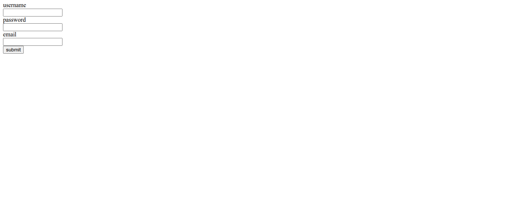
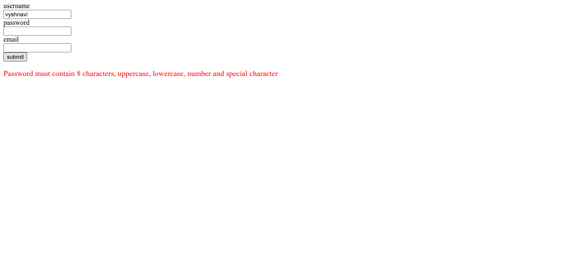
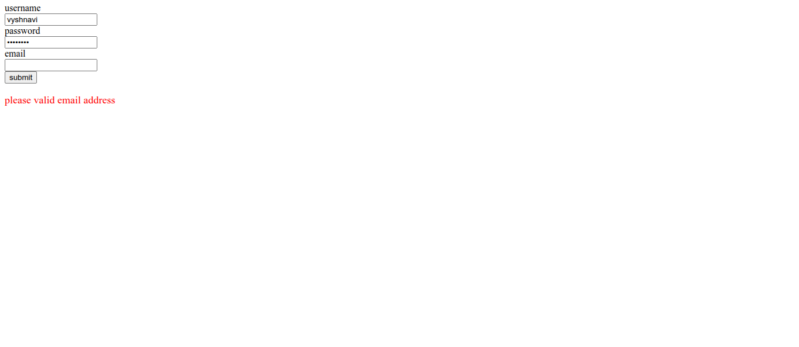
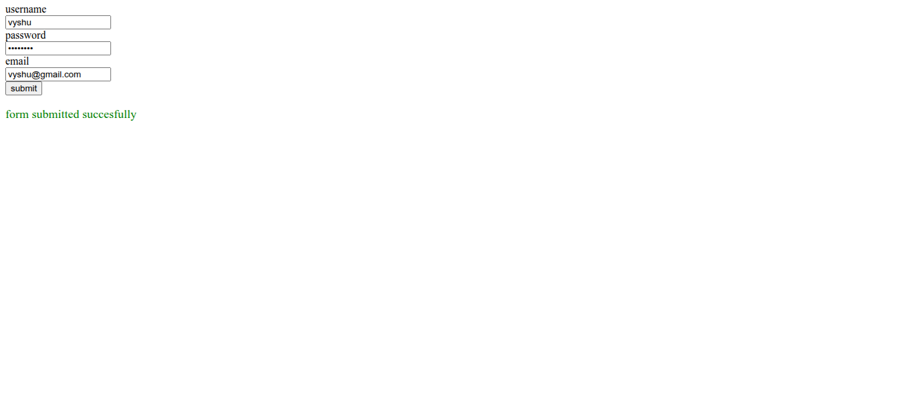

# Form Validation Web Application

A web application that validates user input in real-time to ensure correct and secure form submission. The project focuses on improving user experience by providing instant feedback and error messages.

## 🚀 Features
- Real-time input validation
- Error messages for invalid inputs
- Required field checks
- Email format validation
- Password confirmation validation
- User-friendly form interface

## 📸 Screenshots

### 📝 Empty Form

### ❌ Validation Errors

### 🔄 Input in Progress

### ✅ Successful Validation

## 🛠️ Tech Stack
- HTML
- CSS
- JavaScript

## 📂 Project Structure
- index.html
- style.css
- script.js

## 👩‍💻 Author
Vyshnavi
